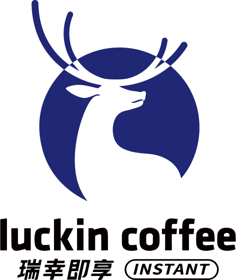

# 【瑞幸即享咖啡会员中心】小程序



## API 接口

### 登录
```shell
curl -H "Host: mall-api.luckincoffeeshop.com" -H "xweb_xhr: 1" -H "locale: zh_CN" -H "authorization: " -H "user-agent: Mozilla/5.0 (Macintosh; Intel Mac OS X 10_15_7) AppleWebKit/537.36 (KHTML, like Gecko) Chrome/107.0.0.0 Safari/537.36 MicroMessenger/6.8.0(0x16080000) NetType/WIFI MiniProgramEnv/Mac MacWechat/WMPF MacWechat/3.8.9(0x13080911) XWEB/1227" -H "content-type: application/json" -H "accept: */*" -H "sec-fetch-site: cross-site" -H "sec-fetch-mode: cors" -H "sec-fetch-dest: empty" -H "referer: https://servicewechat.com/wxcabfbc76cf058d0b/66/page-frame.html" -H "accept-language: zh-CN,zh;q=0.9" --data-binary "{\"code\":\"1de11bbef097f84a02cefb3a27385cfe0778797acc2a6e1023ce1fc2c9729df2\",\"tempUid\":\"a24a93c044764e00b390e41a67ce4cd0\",\"ext\":\"{}\",\"type\":1,\"newInviteUserId\":\"\"}" --compressed "https://mall-api.luckincoffeeshop.com/ma/login"
```

采用微信小程序登录方案，微信 APP 生成的 code 向开发者后台请求换取 access_token，access_token 在后续请求中携带在 Header 中。

> code 生成逻辑未知，因此，此接口无法直接通过接口调通

返回OK
```json
{
	"code": "00000",
	"msg": null,
	"result": null,
	"data": {
		"accessToken": "203f752e-61b0-xxxx-xxxx-b979730214f8",
		"refreshToken": null,
		"expiresIn": 2592000,
		"tmallUser": false
	},
	"version": "zanmall.v231225",
	"timestamp": null,
	"sign": null,
	"success": true
}
```

### 签到
```shell
curl -H "Host: mall-api.luckincoffeeshop.com" -H "xweb_xhr: 1" -H "locale: zh_CN" -H "authorization: 4f451a49-xxxx-xxxx-xxxx-281e6c569b5d" -H "user-agent: Mozilla/5.0 (Macintosh; Intel Mac OS X 10_15_7) AppleWebKit/537.36 (KHTML, like Gecko) Chrome/107.0.0.0 Safari/537.36 MicroMessenger/6.8.0(0x16080000) NetType/WIFI MiniProgramEnv/Mac MacWechat/WMPF MacWechat/3.8.9(0x13080911) XWEB/1227" -H "content-type: application/json" -H "accept: */*" -H "sec-fetch-site: cross-site" -H "sec-fetch-mode: cors" -H "sec-fetch-dest: empty" -H "referer: https://servicewechat.com/wxcabfbc76cf058d0b/66/page-frame.html" -H "accept-language: zh-CN,zh;q=0.9" --data-binary "{}" --compressed "https://mall-api.luckincoffeeshop.com/p/signIn/userSignIn"
```

返回FAIL
```json
{
	"code": "A00001",
	"msg": "今天已经签到过了，请明天再试！",
	"result": null,
	"data": null,
	"version": "zanmall.v231225",
	"timestamp": null,
	"sign": null,
	"success": false
}
```

TODO: 签到成功之后的逻辑？

### 积分抽奖

```shell
curl -H "Host: mall-api.luckincoffeeshop.com" -H "xweb_xhr: 1" -H "locale: zh_CN" -H "authorization: 4f451a49-xxxx-xxxx-xxxx-281e6c569b5d" -H "user-agent: Mozilla/5.0 (Macintosh; Intel Mac OS X 10_15_7) AppleWebKit/537.36 (KHTML, like Gecko) Chrome/107.0.0.0 Safari/537.36 MicroMessenger/6.8.0(0x16080000) NetType/WIFI MiniProgramEnv/Mac MacWechat/WMPF MacWechat/3.8.9(0x13080911) XWEB/1227" -H "content-type: application/json" -H "accept: */*" -H "sec-fetch-site: cross-site" -H "sec-fetch-mode: cors" -H "sec-fetch-dest: empty" -H "referer: https://servicewechat.com/wxcabfbc76cf058d0b/66/page-frame.html" -H "accept-language: zh-CN,zh;q=0.9" --compressed "https://mall-api.luckincoffeeshop.com/p/lottery/lottery?activityId=191"
```

> activityId=191不是来自活动列表接口返回?

返回OK
```json
{
	"code": "00000",
	"msg": null,
	"result": null,
	"data": {
		"turntableId": 6,
		"awardName": "5积分",
		"originName": null,
		"cashCondition": null,
		"isAward": true,
		"imageUrl": "https://static-test.online.wfj.com.cn/zanmall/pc/static/images/marketing/lucky/draw/create/award-points.webp",
		"score": 20,
		"lotteryNum": 1,
		"sendNum": 1,
		"awardPoints": 5,
		"awardType": 3,
		"shopCouponUrl": null,
		"awardFetch": null,
		"awardsId": 783272036530691,
		"lotteryJoinLogId": 1242979
	},
	"version": "zanmall.v231225",
	"timestamp": null,
	"sign": null,
	"success": true
}
```
- 奖品名称 awardNName
- 奖品类型 awardType: 3-积分

重复抽奖返回（也是抽奖成功，消耗了 10 积分抽奖，不是使用签到赠送的抽奖机会，注意区分）
```json
{"code":"00000","msg":null,"result":null,"data":{"turntableId":6,"awardName":"5积分","originName":null,"cashCondition":null,"isAward":true,"imageUrl":"https://static-test.online.wfj.com.cn/zanmall/pc/static/images/marketing/lucky/draw/create/award-points.webp","score":10,"lotteryNum":0,"sendNum":null,"awardPoints":5,"awardType":3,"shopCouponUrl":null,"awardFetch":null,"awardsId":783272036530691,"lotteryJoinLogId":1243106},"version":"zanmall.v231225","timestamp":null,"sign":null,"success":true}
```

返回FAIL
```json
{"code":"A00004","msg":"Unauthorized","result":null,"data":null,"version":"zanmall.v231225","timestamp":null,"sign":null,"success":false}
```

### 用户信息

```shell
curl -H "Host: mall-api.luckincoffeeshop.com" -H "xweb_xhr: 1" -H "locale: zh_CN" -H "authorization: 4f451a49-xxxx-xxxx-xxxx-281e6c569b5d" -H "user-agent: Mozilla/5.0 (Macintosh; Intel Mac OS X 10_15_7) AppleWebKit/537.36 (KHTML, like Gecko) Chrome/107.0.0.0 Safari/537.36 MicroMessenger/6.8.0(0x16080000) NetType/WIFI MiniProgramEnv/Mac MacWechat/WMPF MacWechat/3.8.9(0x13080911) XWEB/1227" -H "content-type: application/json" -H "accept: */*" -H "sec-fetch-site: cross-site" -H "sec-fetch-mode: cors" -H "sec-fetch-dest: empty" -H "referer: https://servicewechat.com/wxcabfbc76cf058d0b/66/page-frame.html" -H "accept-language: zh-CN,zh;q=0.9" --compressed "https://mall-api.luckincoffeeshop.com/p/user/userInfo"
```

返回OK
```json
{
	"code": "00000",
	"msg": null,
	"result": null,
	"data": {
		"token": null,
		"status": 1,
		"userId": "d0467484xxxxxxxx165eb151",
		"userName": null,
		"nickName": "u7591",
		"sex": "0",
		"userMobile": "158xxxx7591",
		"mobile": "158****7591",
		"pic": "2024/12/0611a08d926144ffa375de0a463f6b6b.jpg",
		"birthDate": "1994-05-31",
		"level": 1,
		"levelType": 0,
		"growth": 0,
		"score": 20,
		"balance": 0.0,
		"prodRecommendation": 1,
		"isNewUser": true,
		"openId": "ohoxxxxxxxxxxxxxAyGu56o"
	},
	"version": "zanmall.v231225",
	"timestamp": null,
	"sign": null,
	"success": true
}
```

返回FAIL
```json
{"code":"A00004","msg":"Unauthorized","result":null,"data":null,"version":"zanmall.v231225","timestamp":null,"sign":null,"success":false}
```

### 积分明细

```shell
curl -H "Host: mall-api.luckincoffeeshop.com" -H "xweb_xhr: 1" -H "locale: zh_CN" -H "authorization: 4f451a49-xxxx-xxxx-xxxx-281e6c569b5d" -H "user-agent: Mozilla/5.0 (Macintosh; Intel Mac OS X 10_15_7) AppleWebKit/537.36 (KHTML, like Gecko) Chrome/107.0.0.0 Safari/537.36 MicroMessenger/6.8.0(0x16080000) NetType/WIFI MiniProgramEnv/Mac MacWechat/WMPF MacWechat/3.8.9(0x13080911) XWEB/1227" -H "content-type: application/json" -H "accept: */*" -H "sec-fetch-site: cross-site" -H "sec-fetch-mode: cors" -H "sec-fetch-dest: empty" -H "referer: https://servicewechat.com/wxcabfbc76cf058d0b/66/page-frame.html" -H "accept-language: zh-CN,zh;q=0.9" --compressed "https://mall-api.luckincoffeeshop.com/p/score/page?type=3&current=1&size=10"
```

返回OK
```json
{
	"code": "00000",
	"msg": null,
	"result": null,
	"data": {
		"records": [{
			"logId": null,
			"userId": "d046xxxxxxxxx25c8e7165eb151",
			"source": null,
			"bizId": "b7935290-9d4f-4938-aac2-a02db69f7fa6",
			"bizName": null,
			"isPayed": null,
			"score": 1,
			"ioType": 1,
			"createTime": "2024-12-10 05:14:52",
			"serialNumber": null,
			"refundSn": null,
			"sysUserId": null,
			"remark": "签到加积分",
			"supplierId": null,
			"sysUserName": null,
			"nickName": "u7591",
			"orderNumber": null,
			"isLock": null,
			"sourceRemark": "第三方应用",
			"sourceName": "签到加积分"
		}, {
			"logId": null,
			"userId": "d046xxxxxxxxx25c8e7165eb151",
			"source": null,
			"bizId": "388ccceb-62d6-4575-985f-301f77e9814a",
			"bizName": null,
			"isPayed": null,
			"score": 5,
			"ioType": 1,
			"createTime": "2024-12-05 08:47:39",
			"serialNumber": null,
			"refundSn": null,
			"sysUserId": null,
			"remark": "抽奖赠送积分",
			"supplierId": null,
			"sysUserName": null,
			"nickName": "u7591",
			"orderNumber": null,
			"isLock": null,
			"sourceRemark": "第三方应用",
			"sourceName": "抽奖赠送积分"
		}, {
			"logId": null,
			"userId": "d046xxxxxxxxx25c8e7165eb151",
			"source": null,
			"bizId": "2a897d1b-a7dd-4954-9d19-900b2409f824",
			"bizName": null,
			"isPayed": null,
			"score": 1,
			"ioType": 1,
			"createTime": "2024-12-05 08:47:29",
			"serialNumber": null,
			"refundSn": null,
			"sysUserId": null,
			"remark": "签到加积分",
			"supplierId": null,
			"sysUserName": null,
			"nickName": "u7591",
			"orderNumber": null,
			"isLock": null,
			"sourceRemark": "第三方应用",
			"sourceName": "签到加积分"
		}, {
			"logId": null,
			"userId": "d046xxxxxxxxx25c8e7165eb151",
			"source": null,
			"bizId": "51041577-350b-4804-a8ed-3000bdaaf861",
			"bizName": null,
			"isPayed": null,
			"score": 10,
			"ioType": 0,
			"createTime": "2024-12-03 19:35:01",
			"serialNumber": null,
			"refundSn": null,
			"sysUserId": null,
			"remark": "抽奖消耗积分",
			"supplierId": null,
			"sysUserName": null,
			"nickName": "u7591",
			"orderNumber": null,
			"isLock": null,
			"sourceRemark": "第三方应用",
			"sourceName": "抽奖消耗积分"
		}, {
			"logId": null,
			"userId": "d046xxxxxxxxx25c8e7165eb151",
			"source": null,
			"bizId": "0bfa7be0-9af1-468d-b80e-066cdebdaba7",
			"bizName": null,
			"isPayed": null,
			"score": 5,
			"ioType": 1,
			"createTime": "2024-12-03 19:35:01",
			"serialNumber": null,
			"refundSn": null,
			"sysUserId": null,
			"remark": "抽奖赠送积分",
			"supplierId": null,
			"sysUserName": null,
			"nickName": "u7591",
			"orderNumber": null,
			"isLock": null,
			"sourceRemark": "第三方应用",
			"sourceName": "抽奖赠送积分"
		}, {
			"logId": null,
			"userId": "d046xxxxxxxxx25c8e7165eb151",
			"source": null,
			"bizId": "5f03696f-035f-4a30-af0f-c773cf8d954d",
			"bizName": null,
			"isPayed": null,
			"score": 10,
			"ioType": 1,
			"createTime": "2024-12-03 19:34:39",
			"serialNumber": null,
			"refundSn": null,
			"sysUserId": null,
			"remark": "任务奖励",
			"supplierId": null,
			"sysUserName": null,
			"nickName": "u7591",
			"orderNumber": null,
			"isLock": null,
			"sourceRemark": "第三方应用",
			"sourceName": "任务奖励"
		}, {
			"logId": null,
			"userId": "d046xxxxxxxxx25c8e7165eb151",
			"source": null,
			"bizId": "11e9d0fb-ff15-4643-bd31-838aa2707722",
			"bizName": null,
			"isPayed": null,
			"score": 5,
			"ioType": 1,
			"createTime": "2024-12-03 19:32:33",
			"serialNumber": null,
			"refundSn": null,
			"sysUserId": null,
			"remark": "抽奖赠送积分",
			"supplierId": null,
			"sysUserName": null,
			"nickName": "u7591",
			"orderNumber": null,
			"isLock": null,
			"sourceRemark": "第三方应用",
			"sourceName": "抽奖赠送积分"
		}, {
			"logId": null,
			"userId": "d046xxxxxxxxx25c8e7165eb151",
			"source": null,
			"bizId": "4aa2bcb4-1540-4a1b-b51d-669fe0b06496",
			"bizName": null,
			"isPayed": null,
			"score": 1,
			"ioType": 1,
			"createTime": "2024-12-03 19:32:23",
			"serialNumber": null,
			"refundSn": null,
			"sysUserId": null,
			"remark": "签到加积分",
			"supplierId": null,
			"sysUserName": null,
			"nickName": "u7591",
			"orderNumber": null,
			"isLock": null,
			"sourceRemark": "第三方应用",
			"sourceName": "签到加积分"
		}, {
			"logId": null,
			"userId": "d046xxxxxxxxx25c8e7165eb151",
			"source": null,
			"bizId": "93bf923a-519d-4295-b2aa-3c4a1ec8a392",
			"bizName": null,
			"isPayed": null,
			"score": 1,
			"ioType": 1,
			"createTime": "2024-11-30 09:04:13",
			"serialNumber": null,
			"refundSn": null,
			"sysUserId": null,
			"remark": "签到加积分",
			"supplierId": null,
			"sysUserName": null,
			"nickName": "u7591",
			"orderNumber": null,
			"isLock": null,
			"sourceRemark": "第三方应用",
			"sourceName": "签到加积分"
		}, {
			"logId": null,
			"userId": "d046xxxxxxxxx25c8e7165eb151",
			"source": null,
			"bizId": "51f51aa9-2d36-41d6-b4ab-993e087a919b",
			"bizName": null,
			"isPayed": null,
			"score": 1,
			"ioType": 1,
			"createTime": "2024-11-24 19:22:21",
			"serialNumber": null,
			"refundSn": null,
			"sysUserId": null,
			"remark": "签到加积分",
			"supplierId": null,
			"sysUserName": null,
			"nickName": "u7591",
			"orderNumber": null,
			"isLock": null,
			"sourceRemark": "第三方应用",
			"sourceName": "签到加积分"
		}],
		"total": 12,
		"size": 10,
		"current": 1,
		"pages": 2
	},
	"version": "zanmall.v231225",
	"timestamp": null,
	"sign": null,
	"success": true
}
```

返回FAIL
```json
{"code":"A00004","msg":"Unauthorized","result":null,"data":null,"version":"zanmall.v231225","timestamp":null,"sign":null,"success":false}
```

### 活动列表
```shell

```